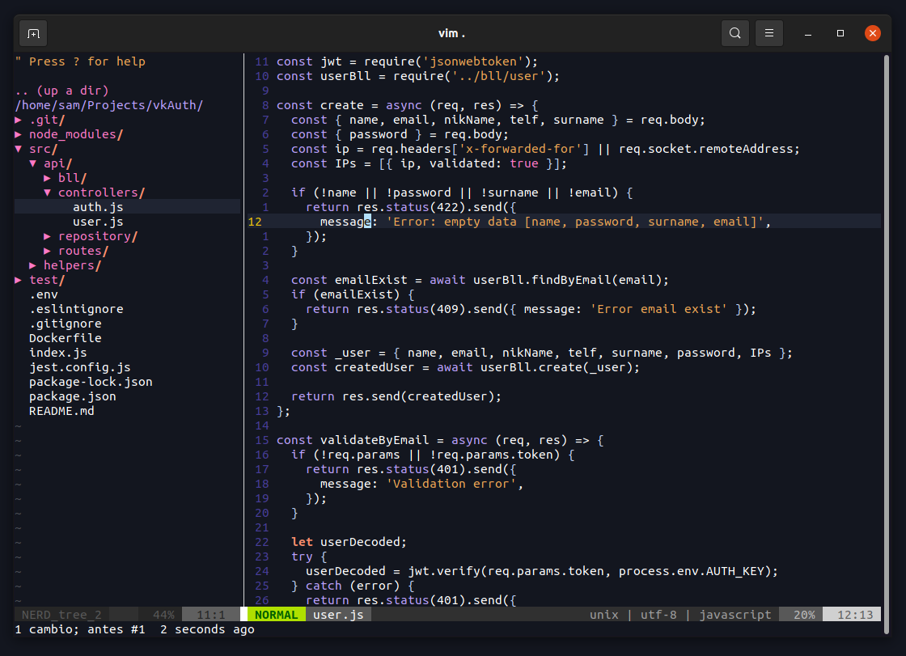

# vim-config

This is my configuration for the Vim text editor



### `Why Vim an not neovim?`
Neovim is better in almost all aspects than Vim, except for one, the speed, Vim, especially when we use the plugins with the native plugin manager, is faster than any other.
## Install
Caution! This will remove your current vim config

### Ubuntu Debian (wget):
```
wget https://github.com/VikingCodeBlog/vim-config/archive/refs/tags/v0.0.3.tar.gz && tar -xvf v0.0.3.tar.gz && cd vim-config-0.0.3 && bash install.sh && cd .. && rm -rf v0.0.3.tar.gz vim-config-0.0.3

```

### Ubuntu Debian (git):
```
git clone https://github.com/VikingCodeBlog/vim-config.git && bash ./vim-config/install.sh

```

## Folder architecture
If you use the `install.sh` script, the .vim folder and the .vimrc file will be saved inside the ~ / .config folder. In addition, the installer will create the necessary symbolic links in $HOME to the files in the .config folder.

```bash
.vim
├── colors
│   └── berserker
├── .maps
├── pack
│   ├── plugins
│   │   └── start
│   └── vendor
│       └── start
├── plugin
│   ├── lightline.vim
│   └── nerdtree.vim
├── .routes
└── styles
    ├── .theme
    └── .lines
.vimrc
```

### Files
#### .vimrc
It is the initial configuration file, in it I have the basic Vim configuration and the paths to the other configuration files.
#### .maps
This file contains my list of keyboard shortcuts for working with Vim.

#### .routes
List of paths that I use throughout the configuration files

#### `Why do I use different configuration files and I don't have everything inside .vimrc?`
I know it would be better to have all the configuration inside .vimrc but I don't feel comfortable working with large files, I like being able to organize the configuration by categories.

### Folders
#### packs
This is where the Vim plugins are installed.

#### plugin
This is the folder I use to configure the installed plugins, by default, Vim will use all the * .vim files found in this folder.
#### styles
I use this folder to store the settings that modify the visual styles of Vim.

## Plugins
In this configuration I do not use "external" plugin managers to Vim (Pathogen, Vundle, Vim-Plug, Dein), since Vim version 8+, I have been using the native Vim packs.

### NERDTree
Official repository -> https://github.com/preservim/nerdtree

The NERDTree is a file system explorer for the Vim editor. Using this plugin, users can visually browse complex directory hierarchies, quickly open files for reading or editing, and perform basic file system operations.

#### Config

```vim
let NERDTreeShowHidden=1        " Allow to see hiden files.
autocmd VimEnter * NERDTree     " Init vim with NERDTree open
map <C-b> :NERDTreeToggle<CR>   " Maped macro to toggle nerdtree
```

### Lightline
Official repository -> https://github.com/itchyny/lightline.vim

A light and configurable statusline/tabline plugin for Vim.

`Why Lightline an not another powerline like vim-powerline, powerline or vim-airline?`

Basically because it has no dependencies on other plugins and it is easy to configure.
https://github.com/itchyny/lightline.vim#why-yet-another-clone-of-powerline


## Theme
I don't use external plugins to customize VIM, I have created my own color scheme in the .vim/colors folder and a few modifications in styles/theme.